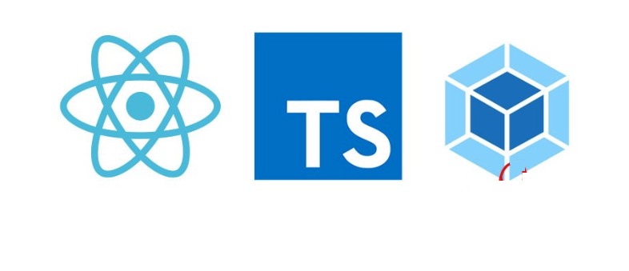

------

## React & Typescript with Webpack

#### 从头搭建一个基于react + ts + webpack + Hooks 的开发环境

```shell
  // 初始化文件夹文件和 package.json

  $  mkdir React-Typescript-Hooks

  $  touch webpack.config.js index.html

  $  npm init -y
```
#### 打开 webpack.config.js文件，初始化简单的 webpack 配置
```javascript
const path = require("path");

module.exports = {
entry: "./src/index.tsx",
    output: {
        path: path.resolve(__dirname, "build"),
        filename: "bundle.js"
    },
    module: {},
    plugins: []
};
```
#### 然后新增一个入口文件index.tsx
```javascript
import * as React from "react";
import * as ReactDOM from "react-dom";

const ROOT = document.querySelector(".container");

ReactDOM.render(<h1>Hello</h1>, ROOT);
```
##### 注：for Typescript you have to import all (*) as React.

#### 接着需要安装react，webpack依赖模块
```shell
  // 注：webpack4.0后，webpack 命令行相关的内容都迁移到 webpack-cli，除了 webpack 外，我们还需要安装 webpack-cli

  $  npm i react react-dom

  $  npm i webpack webpack-dev-server webpack-cli -D
```

#### 我们现在已经有了ts的文件，但是webpack并不能解析，所以需要安装ts解析器 awesome-typescript-loader，为什么不用ts-loader，而选择用 awesome-typescript-loader，你可以[点击这里查看。](https://github.com/s-panferov/awesome-typescript-loader#differences-between-ts-loader)

```shell
  $  npm i typescript awesome-typescript-loader -D
```
#### 更新webpack.config，新建对tsx的规则处理
```js
  module: {
  rules: [
    {
      test: /\.tsx?$/,
      loader: "awesome-typescript-loader"
    }
  ]
},
```

#### 我们还需要在根路径创建一个 tsconfig.json 文件，来告诉 webpack 如何去处理TS的文件
```js
  {
  "compilerOptions": {
    "allowSyntheticDefaultImports": true,
    "jsx": "react",
    "module": "commonjs",
    "outDir": "./build/",
    "preserveConstEnums": true,
    "removeComments": true,
    "sourceMap": true,
    "noImplicitAny": true,
    "target": "es5"
  },
  "include": [
    "./src/**/*"
  ]
}
```
#### 接下来我们需要安装react的声明文件，由于 React 和 React-dom 并不是使用 TS 进行开发的，所以 TS 不知道 React、 React-dom 的类型，以及该模块导出了什么，此时需要引入 .d.ts 的声明文件。
```shell
  $  npm i @types/react @types/react-dom -D
```

#### 接下来就只要将webpack.config中的test命令更改成下面，就可以直接启动项目了,然后在浏览器中输入localhost:8080 就可以直接查看。
```json
  "start": "webpack-dev-server"
```


